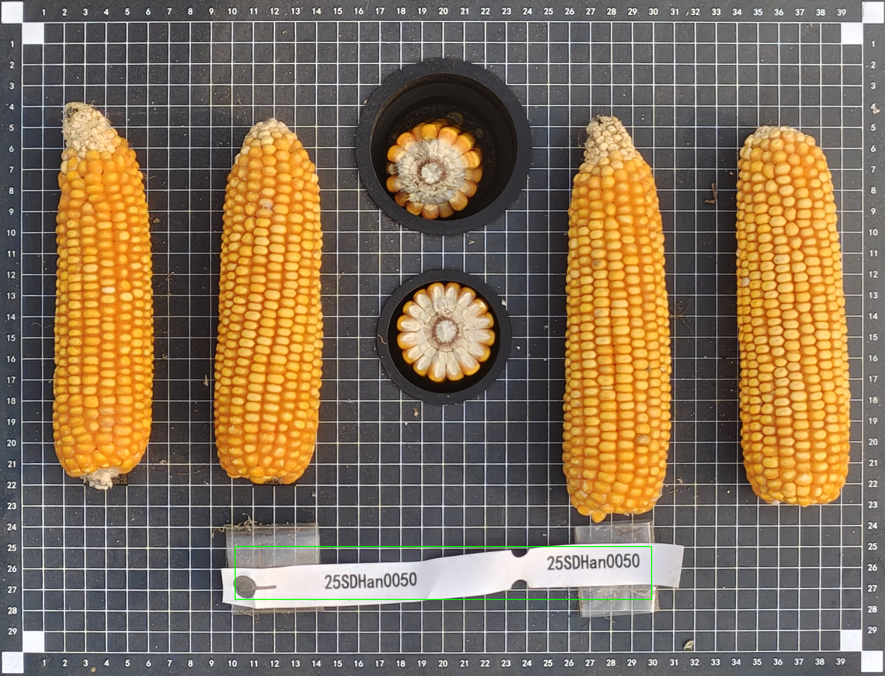
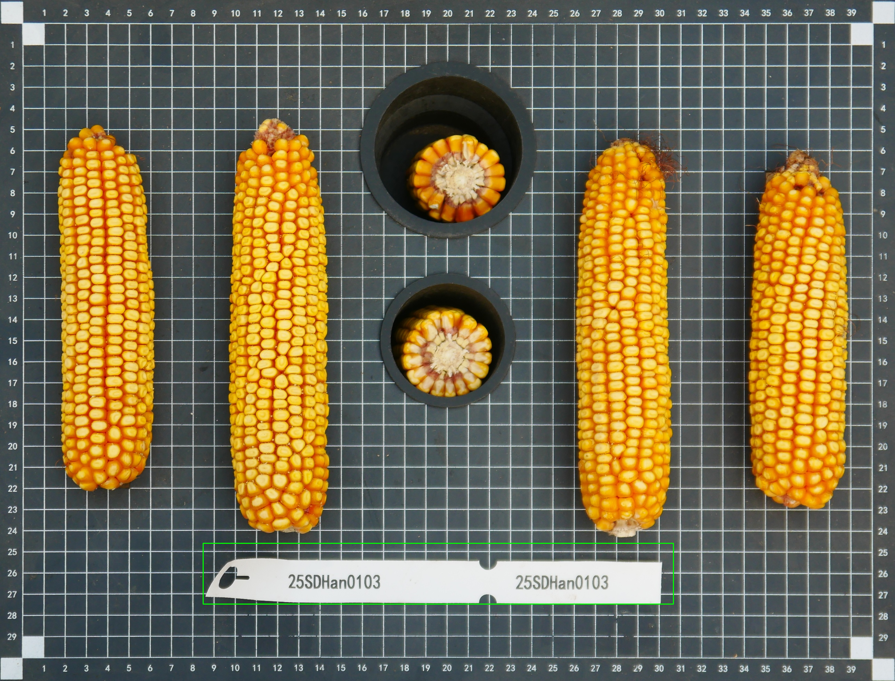
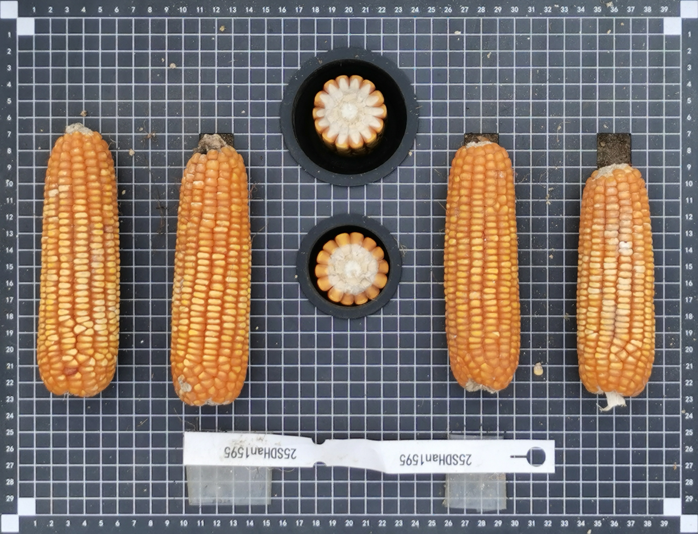
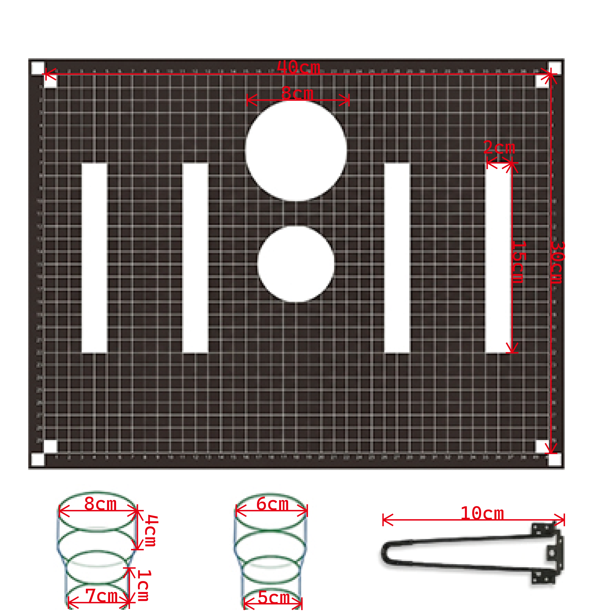
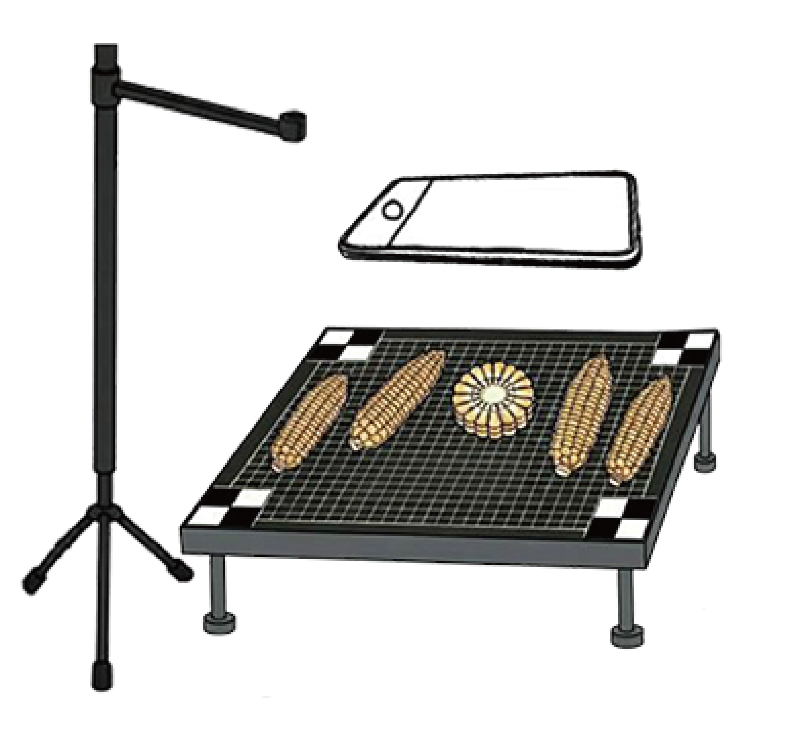

# EasyMEP

EasyMEP 是一个面向玉米果穗表型分析的在线系统，支持图像上传、任务排队执行与结果导出。

系统当前支持：

- 基于定制测量板的玉米果穗照片上传
- 玉米果穗掩膜提取及穗长，穗宽性状的提取
- 玉米截面籽粒识别及穗行数提取
- 玉米果穗籽粒识别及行粒数提取
- 玉米籽粒厚度提取
- 已完成任务结果文件下载

## 在线体验

[打开 EasyMEP](http://zeasystemsbio.hzau.edu.cn/tools/easymep/)

## 测试图片

用户可以直接使用下面几张样图进行测试：

## 设备依赖

EasyMEP 能够实现的玉米果穗性状检测依赖固定的比例尺，因此需要借助 MEP Board 四角特征点的识别矫正。MEP Board 的设计如下图所示：

- 整体以 1 cm² 网格板为背景，便于果穗图片文件的溯源；
- 其凹槽用于固定玉米果穗，避免复杂地形导致果穗自由滚动；
- 四角的黑白特征点用于图像的畸变矫正；
- 为降低拍摄误差，摄像头距离板面 130 cm 处为宜。
S

## 说明

- 线上演示地址主要用于轻量测试，建议优先使用示例图片体验流程。
- 用户上传照片时，请尽可能请保持图片为**横向**，轻微的角度偏转并不影响 EasyMEP 角点的识别。
- 引用：
- 如想进一步了解 EasyMEP，可以联系yuyz@webmail.hzau.edu.cn。
